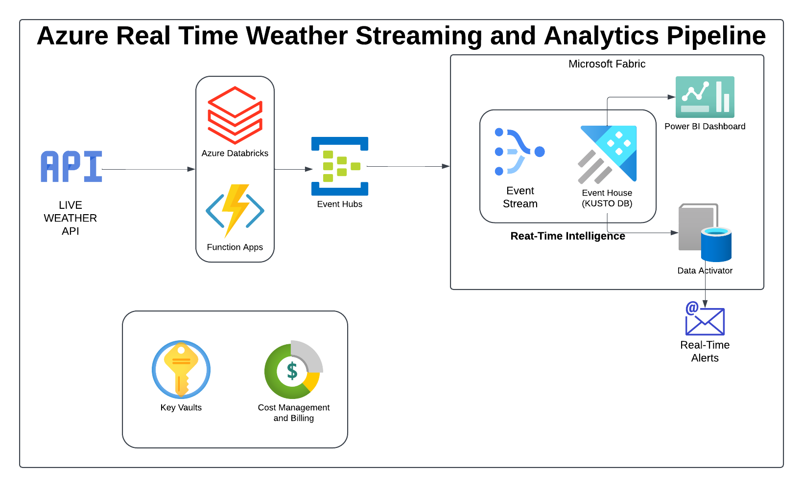

# Azure Live Weather Streaming and Analytics Pipeline

This project demonstrates how to build an end-to-end real-time weather data streaming solution using Azure services. The system fetches live weather data from a weather API, processes it in real time, and visualizes actionable insights using Power BI.

---

## **1. Resource Setup**

### **Creating Resource Groups:**  
1. A **resource group** was created to organize and manage all Azure resources required for the project.  
2. The following services were provisioned within the resource group:  
   - **Azure Databricks Workspace:**  
     - Configured with the **Premium Pricing Tier**, allowing role-based access control for enhanced security.  
   - **Azure Function App:** To manage serverless execution of functions when needed.  
   - **Azure Event Hubs:** To act as the messaging and event streaming platform.  
   - **Azure Key Vault:** To securely store sensitive data, such as API keys.  
   - **Microsoft Fabric:** Integrated for **Power BI**, as Power BI is part of the Fabric ecosystem.  

3. In **Azure Key Vault**, a secret was created to securely store the Weather API key, enabling secure access for the project.

---

## **2. Data Ingestion Using Databricks**

### **Steps:**  

#### **a. Setting Up Event Hub in Azure Event Hubs:**  
   - An Event Hub was created within the Event Hubs namespace. This Event Hub serves as the central messaging system to handle the ingestion of weather data from Databricks.

#### **b. Databricks Cluster Setup:**  
   - A compute cluster was created in **Azure Databricks** for data processing.  
   - The Event Hub library was installed on the Databricks cluster to enable interaction with Azure Event Hubs using Python.  

#### **c. Configuring Key Vault Secrets in Databricks:**  
   - A **secret scope** was created in Databricks to securely access secrets stored in **Azure Key Vault**.  
   - This step ensured that Databricks could securely retrieve the Weather API key without exposing it in the code.  

#### **d. Connecting to the Weather API:**  
   - The connection to the Weather API was established from Databricks to fetch real-time weather data.  
   - API methods used in this project included:  
     - **Current Weather**  
     - **Weather Forecast**  
     - **Weather Alerts**  

#### **e. Data Transformation and Flattening:**  
   - Data fetched from the API was transformed and flattened into **JSON format** to standardize it for processing and storage.  
   - Specific APIs were used to retrieve current weather details, forecasted data, and alerts. Each response was validated and transformed as required.

#### **f. Streaming Data to Event Hub:**  
   - The flattened JSON data was packaged into batches and sent to **Azure Event Hub**.  
   - Data streaming was performed every 30 seconds using **Apache Spark** in Databricks, ensuring near-real-time data ingestion.

---

## **3. Event Processing and Loading**

### **Steps:**  

#### **a. Integration with Power BI:**  
   - **Microsoft Fabric** was configured to connect Power BI to Azure Event Hubs.  
   - Necessary access permissions were granted to Fabric, enabling seamless integration between Power BI and Event Hubs for data visualization.  

#### **b. Creating a KQL Database:**  
   - A **KQL (Kusto Query Language)** database was set up using **Azure Data Explorer**.  
   - The data streamed from Event Hubs was stored in this database for advanced querying and analytics.  
   - The KQL database acts as a central repository to store time-series weather data efficiently.  

---

## **4. Key Features of the Project**

1. **Real-Time Streaming:**  
   - Live weather data is fetched and streamed to Event Hubs every 30 seconds, ensuring near-real-time updates.

2. **Secure Data Handling:**  
   - **Azure Key Vault** ensures secure storage and access to sensitive credentials, such as the Weather API key.

3. **Scalable Insights with Power BI:**  
   - Real-time visualizations and dashboards created in Power BI allow users to monitor live weather conditions, forecasts, and alerts.  
   - Dashboards enable quick decision-making, particularly useful for industries such as logistics, agriculture, and disaster management.

4. **Actionable Data:**  
   - Data is transformed, structured, and stored in a **KQL database** for further analytics and reporting.

5. **Cloud-Native Infrastructure:**  
   - The solution leverages Azure's native services, ensuring scalability, reliability, and efficient cost management.

---

## **Use Cases**

This project is applicable in various domains:
- **Disaster Management:** Real-time alerts for extreme weather events.  
- **Logistics:** Weather data enables route optimization and risk management.  
- **Agriculture:** Real-time insights into weather conditions for crop planning.  
- **Urban Planning:** Monitoring weather patterns to manage infrastructure.  

---

